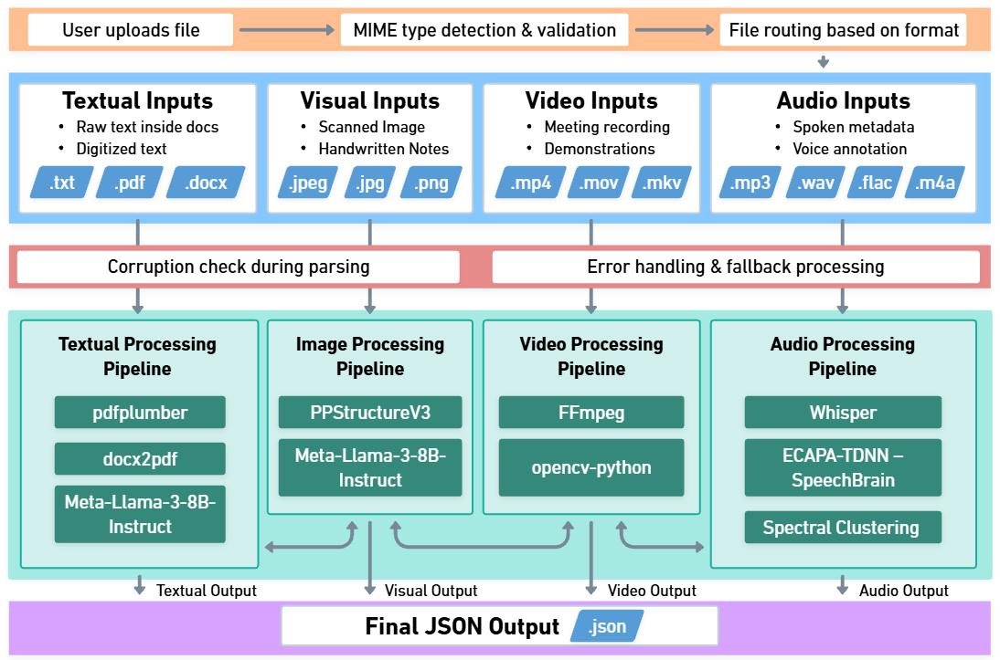
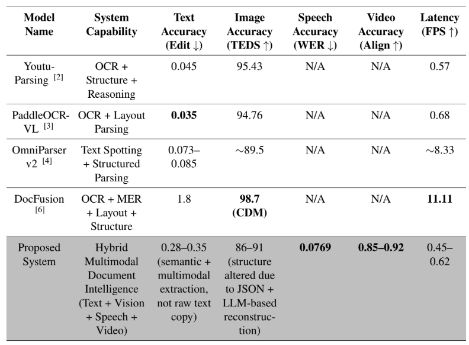
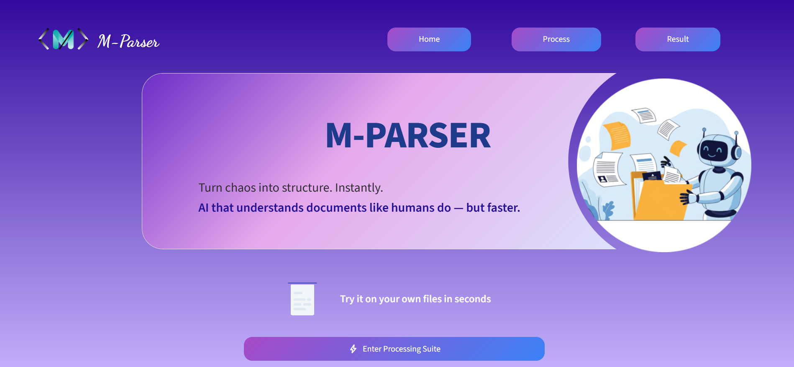

# 📄 A Multimodal AI-Powered Hybrid Approach to Document Parsing
A Python-based multimodal document parsing system capable of extracting structured information from **documents, images, audio, and video files** and converting the extracted content into machine-readable JSON. The framework combines **PPStructureV3** for OCR and layout analysis, **Whisper** for speech transcription, **SpeechBrain** for audio embedding and **Spectral Clustering** for speaker diarization, and **Meta Llama 3 8B Instruct** (via "llama-cpp-python") to generate structured outputs. Additionally, the system supports **Braille conversion**, enabling accessibility for visually impaired users.

---
## 🚀 Features

- 🧩 **Multimodal Input Support**  
  Handles PDFs, DOCX, plain text, images, audio, and video.

- 📄 **Intelligent Document Parsing**
  Extracts text blocks, tables, images, and layout information from PDF, DOCX and TXT files while preserving reading order before generating structured JSON outputs.

- 🔍 **Hybrid Visual Information Extraction**
  Uses PPStructureV3 for OCR and layout analysis and leverages Meta Llama 3 to convert extracted content into structured JSON with an OCR-based fallback mechanism.

- 🤖 **LLM Integration**  
  Llama3 converts parsed content into structured JSON.

- 🎤**Efficient Audio Transcribing along with Speaker Diarization**
  Implements speech transcription using Whisper and speaker diarization using Resemblyzer and Spectral Clustering to generate speaker-labeled transcripts.

- 🎥 **Hybrid Video Understanding Pipeline**
  Extracts audio using FFmpeg, identifies slide frames using motion analysis and SSIM-based duplicate removal, and combines OCR with speech transcripts to generate structured outputs.
  
- ⚡ **Singleton Model Loading**  
  LLM, OCR and Whisper models are loaded only once for maximum efficiency.

- ⠿ **Braille Document Parsing**
Converts structured JSON output into Braille code for visually impaired users.

- 🛡️ **Safe Loading**  
  Gracefully handles unsupported file types or corrupted files.

---
## 🧠 System Architecture



---

## 📊 Comparative Performance Analysis

The proposed hybrid multimodal framework was compared with existing document understanding systems. Unlike traditional single-modality approaches, the system integrates text, image, speech, and video processing into a unified pipeline while maintaining competitive performance across modalities.


---

## 🖼️ User Interface



Interactive interface for uploading files and visualizing structured outputs.

---

## 🛠️ Core Technologies

- Python
- PaddleOCR PPStructureV3
- Meta Llama 3 8B Instruct
- llama-cpp-python
- Whisper
- Resemblyzer
- Spectral Clustering
- OpenCV
- SSIM
- FFmpeg
- PyTorch

---

## ⚙️ Installation

1. **Clone the repository**:

```bash
git clone <your-repo-url>
cd multimodal_document_parsing
```

2. **Install dependencies**:

```bash
pip install -r requirements.txt
```

> **Note:**  
> - **PaddlePaddle** requires the extra index URL as specified in `requirements.txt`.  
> - **Llama.cpp** backend requires a C++ compiler. On Windows, install **Visual Studio with C++ build tools**. On Linux/macOS, ensure `g++` or `clang++` is installed.  
> - **docx2pdf** requires **Microsoft Word** to be installed, as it uses Word for conversion.

3. Install FFmpeg (required for audio/video processing):

Windows:

- Download the essentials build from https://www.gyan.dev/ffmpeg/builds/ → ffmpeg-release-essentials.zip.

- Extract to C:\ffmpeg. Inside, you should see C:\ffmpeg\bin\ffmpeg.exe.

- Add C:\ffmpeg\bin to your System PATH:

  - Press Windows Key, search Environment Variables → Edit system environment variables → Environment Variables

  - Under System Variables → Path → Edit → New, add C:\ffmpeg\bin

- Restart your terminal and verify:

```bash
ffmpeg -version
```

Linux/macOS:

```bash
# Ubuntu/Debian
sudo apt update
sudo apt install ffmpeg -y

# macOS (with Homebrew)
brew install ffmpeg

# Verify installation
ffmpeg -version
```

4. **Download the Llama3 model**:

Make sure the model is saved in the app/models directory as llama3.gguf:

```bash
mkdir -p app/models
curl -L -C - -o "app/models/llama3.gguf" "https://huggingface.co/QuantFactory/Meta-Llama-3-8B-Instruct-GGUF/resolve/main/Meta-Llama-3-8B-Instruct.Q4_K_M.gguf"
```

---

## ⚙️ GPU Setup (Optional)

If you have an NVIDIA GPU and want faster inference, follow these steps.

### 1️⃣ Install PyTorch with GPU

Check your CUDA version and install the matching `torch` package:

```bash
# Example for CUDA 12.2
pip install torch torchvision torchaudio --index-url https://download.pytorch.org/whl/cu122
# Replace cu122 with your CUDA version (cu117, cu118, etc.).
```
### 2️⃣ Build llama-cpp-python with CUDA support

On Windows:

```bash
set FORCE_CMAKE=1&& set CMAKE_ARGS=-DGGML_CUDA=ON -DCMAKE_CUDA_FLAGS="--compiler-options=/Zc:preprocessor" && pip install --no-cache-dir llama-cpp-python
```

On Linux/macOS:

```bash
FORCE_CMAKE=1 CMAKE_ARGS="-DGGML_CUDA=ON" pip install --no-cache-dir llama-cpp-python
```

Notes:

- C++ compiler required:
  - Windows: Visual Studio with C++ Build Tools
  - Linux/macOS: g++ or clang++
- CUDA Toolkit: Required for GPU compilation.
- NVIDIA GPU Driver: Ensure it matches your CUDA version.

### 3️⃣ Whisper GPU Usage

Whisper automatically uses GPU if PyTorch detects one.  
No additional configuration is required beyond installing PyTorch with GPU support.

---

## 🏃 Usage

Run the application using:

```bash
python -m app
```

> **Note:** The main processing logic is handled in `__main__.py`. Simply provide the path to your file in the user_uploads folder. The script will automatically detect the file type (text, PDF, or image) based on the extension and route it to the appropriate processing pipeline. JSON output will be saved in final_json_output with a timestamped filename.

---

## 🌟 Future Improvements

### 🔧 Model Fine-Tuning
- Fine-tune models on domain-specific datasets.
- Improve inference efficiency using GPU acceleration.

### 🧠 Retrieval-Augmented Generation (RAG)
- Enable semantic querying over parsed documents.

### 🌐 Multilingual Support
- Extend parsing capabilities to multiple languages.

---

## 📝 Closing Thoughts

This project demonstrates a hybrid multimodal approach to document parsing by integrating OCR, speech processing, video understanding, and large language models into a unified framework. By supporting multiple input modalities and providing structured JSON outputs with accessibility features such as Braille conversion, the system aims to bridge the gap between unstructured data and machine-readable knowledge while enabling more inclusive information access.
